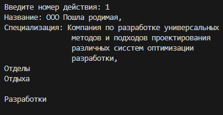

#### Attention!
This markdown file contains a description in two languages. If it's convenient for you to continue in English, just read on.

Этот файл содержит описание на двух языках. Если вам удобнее читать на русском, пролистайте примерно в середину документа.

---
# First semester projects

This repository contains all projects of the Fundamentals of Programming course from the first semester of Faculty of Software Engineering (computer science) of SibFU. 

## Project 1

__Task:__ Write a program that calculates the *n*th generalized Fermat number using the formula:
$$x(n)=a^i+b^i,$$
$$2 ≤ a, 1 ≤ b, 0 ≤ b$$ 
Where 
$$i = 2^n$$ 
And check the divisibility of the resulting number by 2, 3 and 5.

__Input Values:__ numbers *a*, *b* and *n*
__Export:__ The *n*th number of the sequence, the message about
the divisibility of the received number.

__Description:__
This project tested basic knowledge about working with the IDE. A fairly simple task with an equally simple solution.

__Usage exaple__:


## Project 2
__Task:__ In a randomized two-dimensional array find all the necessary values:
1) Find the number of "1"
2) Find the number of "0"
3) Find the number of "1" and "0" in a given row

__Input values:__ Action number. 
__Export:__ Some number.

__Description:__
This practical work was aimed at studying arrays. The functions are simple, there are no complicated points in the logic of the code. Instead of the ones and zeros that are specified in the task, sold and free tickets are used.

__Usage example:__


## Project 3
__Task:__ Write a selection sort function. 

__Input values:__ Array of numbers.
__Export:__ Sorted array.

__Description:__
In this practical work the simplest sorting function was written. In addition, there are few menu and input check functions. 
Sort function:
```
def selection_sort(arr):
    """ sorts by choise """
    arr_lenght = len(arr)
    for i in range(arr_lenght):
        min_index = i
        for j in range(i+1, arr_lenght):
            if arr[j] < arr[min_index]:
                min_index = j
        arr[i], arr[min_index] = arr[min_index], arr[i]
    return arr
```

__Usage example:__


## Project 4
__Task:__ 
Write a programm that stores information about universities.
Structure: Name, opening year, amount of faculties, number of students. 
The program must let:
+ Download information from a file
+ Search for a university by name
+ Filter for a universities by the number of students
+ Add new universities
+ Delete universities
+ Save information in a file

Use the _json_ module to complete the task.

__Input values:__ The task number.
__Export:__ The necessary information.

__Description:__
All tasks are separated by function. There is a _json_ file named "data.json". There is a dictionary with universities information in this file. As always, the Menu function and input verification have been added in the program.

__Usage example:__


## Project 5 

There is some problem with projects numeration in my course. Because of this, I just made this empty project. But it is still a very important project in my education.

__The whole code:__
```
print(":DDDDDDDD:")
print("it's like :) and ):")
print("Mio the best")
```

## Project 6 
__Task:__
Write a program that stores information about the organization, employees, and departments. There are a number of departments in the organization, each of which has a number of workers at different posts.
Develop and implement a class diagramm and all the necessary methods and functions.

__Input values:__ The task number.
__Export:__ The necessary information.

__Description:__
That was my first project with classes. 
It contains three classes. Each of which contains arguments:
+ Organization
    + Departments database 
    + Organization name
    + Docstring
+ Department 
    + Employees database
    + Department name 
    + Number of workers 
    + The department`s purpose
+ Employee
    + Name
    + Work phone number
    + E-mail
    + Age
    + Post

The program allows the user to get information about the organization, department and employee. In addition it allows add and delete departments and employees from databases. By database, I mean a dictionary with class objects.

__Diagram:__


__Usage example:__



## Project 7

__Task:__ 
Implement a GUI by using GUI library 
Place the implementation of the graphical interface in a separate file.

__Description:__
The Tkinter library was used in this project. In addition, the entire graphics module works on the principle of OOP. The basis of the program is taken from project 6

__Usage example:__


---
# Проекты 1-го семестра

В этом репозитории собраны все проекты курса "Основы программирования" за первый семестр 2023-2024 года факультета программной инженерии СФУ.

## Проект 1

__Задача:__ Написать программу, которая вычисляет *n*-е обобщенное число Ферма по формуле:
$$x(n)=a^i+b^i,$$
$$2 ≤ a, 1 ≤ b, 0 ≤ b$$ 
Где 
$$i = 2^n$$ 
И проверяет делимость этого числа на 2, 3 и 5.

__Входные данные:__ Числа  *a*, *b* и *n*
__Вывод:__ *N*-ое число последовательности, проверка его на делимость данных чисел.

__Описание:__
В этом проекте проверяются базовые навыки работы с языком и IDE. Очень простая задача с не менее простым решением.

__Пример использования:__


## Проект 2
__Задача:__ В двумерном массиве найти все необходимые значения:
1) Найти количество едениц
2) Найти количество нулей
3) Найти количество едениц и нулей в данной строке

__Входные данные:__ Номер задачи.
__Вывод:__ Некоторое число.

__Описание:__
Практическая работа направлена на изучение двумерных массивов. Функции просты, нет сложных моментов в логике кода. Вместо едениц и нулей в массиве представлены купленные и свободные места в зале кинотеатра.

__Пример использования:__


## Проект 3
__Задача:__ Реализовать программу сортировки выбором. 

__Входные данные:__ Массив чисел.
__Вывод:__ Отсортированный массив. 

__Описание:__
В этой практической работе была написана простейшая функция сортиовки. Кроме того, добавлены функции проверки ввода и реализовано меню пользователя.
Функция сортировки:
```
def selection_sort(arr):
    """ sorts by choise """
    arr_lenght = len(arr)
    for i in range(arr_lenght):
        min_index = i
        for j in range(i+1, arr_lenght):
            if arr[j] < arr[min_index]:
                min_index = j
        arr[i], arr[min_index] = arr[min_index], arr[i]
    return arr
```

__Пример использования:__


## Проект 4
__Задача:__ 
Написать программу, хранящую информацию об институтах. 
Структура: Название, год открытия, количество факультетов, количество студентов. 
Програма должна позволять:
+ Загружать информацию из файла
+ Искать ВУЗ по названию
+ Фильтровать ВУЗы по количеству студентов
+ Добавлять ВУЗы
+ Удалять ВУЗы
+ Сохранять информацию в файл

Использовать модуль _json_ для выполнения задачи.

__Входные данные:__ Номер действия.
__Вывод:__ Нужная информация.

__Описание:__
Все действия распределены по функциям. Присутствует _json_ файл с названием "data.json". Там хранится словарь с данными о ВУЗах. Функция проверки ввода и меню пользователя, как и всегда, были добавленны в программу. 

__Пример использования:__


## Проект 5 

В нумерации проектов в моем курсе есть небольшой казус. Из-за этого я просто создал пустой проект. Но это все еще очень важный проект в моем обучении.

__Весь код:__
```
print(":DDDDDDDD:")
print("it's like :) and ):")
print("Mio the best")
```

## Проект 6 
__Задача:__
Напиcать программу, хранящую информацию об организации, ее отделах и сотрудниках. В организации есть несколько отделов, в каждом из которых есть некоторое количество сотрудников на разных должностях.
Разработать и реализовать диаграмму классов со всеми необходимыми функциями. 

__Входные данные:__ Номер действаия.
__Вывод:__ Необходимая пользователю информация.

__Описание:__
Это мой первый проект с классами.
В нем находится три класса. Каждый из них содержит свои аргументы:
+ Organization / Организация
    + Departments database / База 
    + Organization name
    + Docstring
+ Department 
    + Employees database
    + Department name 
    + Number of workers 
    + The department`s purpose
+ Employee
    + Name
    + Work phone number
    + E-mail
    + Age
    + Post

Программа позволяет получать информацию об организации, отделах и сотрудниках. Кроме того, она дает возможность добавлять и удалять отделы и сотрудников из баз. Под базами я подразумеваю словари с объектами классов.

__Диаграмма:__


__Пример использования:__


## Проект 7

__Задача:__
Разработать графический интерфейс, используя любую библиотеку для этого.
Расположить реализацию интерфейса в отдельном файле.

__Описание:__
В этом проекте использована библиотека Tkinter. Графическая часть разработана на приципе классов. Логика программы взята из 6 проекта.

__Пример использования:__


